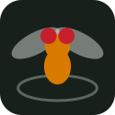

# Brute Flies

A fly-duel game in a single HTML file. Two flies ram each other around a
three-dimensional arena, and neither is fully under anyone's control: each fly
keeps making turns of its own, and upgrades itself between rounds without
asking.

## Play

Open `index.html` in any browser. There is nothing to install or build.

To put it online, turn on GitHub Pages for this repository (Settings → Pages →
deploy from the `main` branch, root folder). The game will be served at
`https://<your-username>.github.io/<repo-name>/`.

## How it works

- Flies move in three dimensions inside a round arena. A shadow and a drop line
  show each fly's height.
- Steer with turn, climb and dive, and lunge to ram. A lunge that connects does
  damage and knocks the other fly back; being knocked into the wall hurts more.
- Win a round by knockout, or by having more health after 45 seconds. First to
  three rounds wins the match.
- Your steering is only a bias. Each fly makes sharp turns of its own, in bursts
  separated by long glides. A fly in the middle of one of its own turns takes
  half damage.
- Before a match the flies fly free with no pilot at all, so you can watch the
  spontaneous behaviour on its own.

## Pilots

- **Player vs AI** — you fly the first fly.
- **Player vs player** — two people on one keyboard or one touch screen.
- **AI vs AI** — both flies are piloted by the computer; rounds advance on
  their own.

Player 1 uses A and D to turn, W and S to climb and dive, and Space to lunge.
Player 2 uses the arrow keys and Enter. With one human player the arrow keys
work as well. On a touch screen, use the on-screen pads.

## Upgrades you do not choose

Flies hatch with random traits. After every round each fly molts twice:

- **Habit** follows what the fly did on its own during the round. Many turns
  grow Agility, a long glide grows Speed, wide turns grow Whim.
- **Leap** picks any trait and a heavy-tailed size: usually +1, occasionally
  +6.

The traits are Speed (cruising pace), Agility (steering rate), Brawn (ram
damage), Shell (health), Nerve (shorter wait between lunges) and Whim (wider
spontaneous turns).

## The science

The game is based on:

Maye A, Hsieh C-h, Sugihara G, Brembs B (2007). Order in Spontaneous Behavior.
PLoS ONE 2(5): e443. https://doi.org/10.1371/journal.pone.0000443

The authors tethered fruit flies in a uniformly white arena and recorded the
turning force each fly produced with nothing to react to. The timing of the
flies' turns was neither random in the coin-flipping sense nor regular: the
gaps between turns were heavy-tailed, like a Lévy flight, and carried the
signature of a nonlinear process. The authors argue that brains have a
mechanism for initiating behaviour spontaneously.

Each fly in the game carries a toy initiator: two noisy chaotic maps that set
the gap to the next turn, its direction and its size. The strip chart under the
arena plots those turns as torque spikes. This is an illustration of the idea,
not the model or the analysis from the paper.

## Files

- `index.html` — the whole game: markup, styles and script
- `logo.svg` — repository logo and page icon
- `LICENSE` — MIT licence

## License

MIT. See `LICENSE`.
